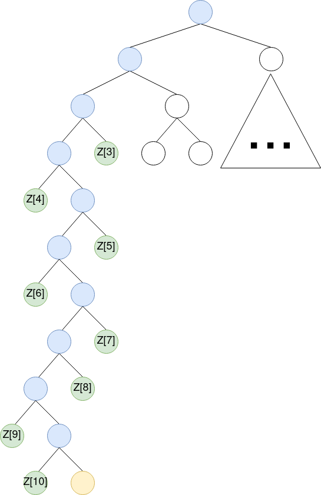
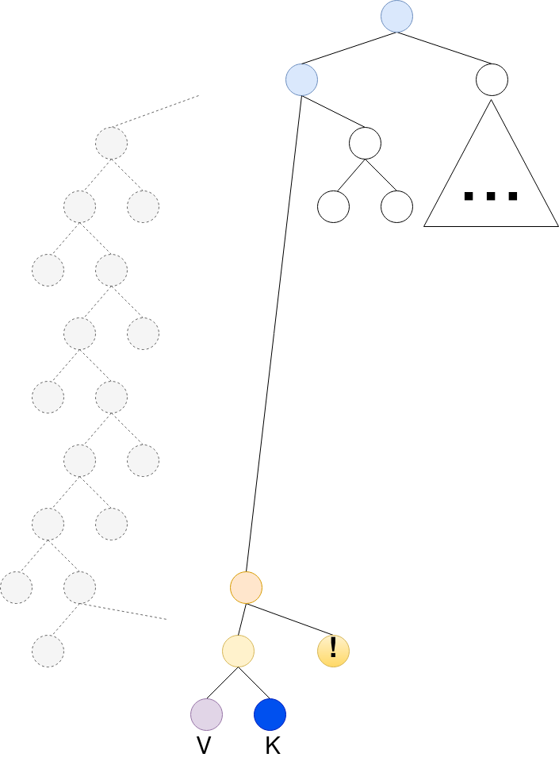
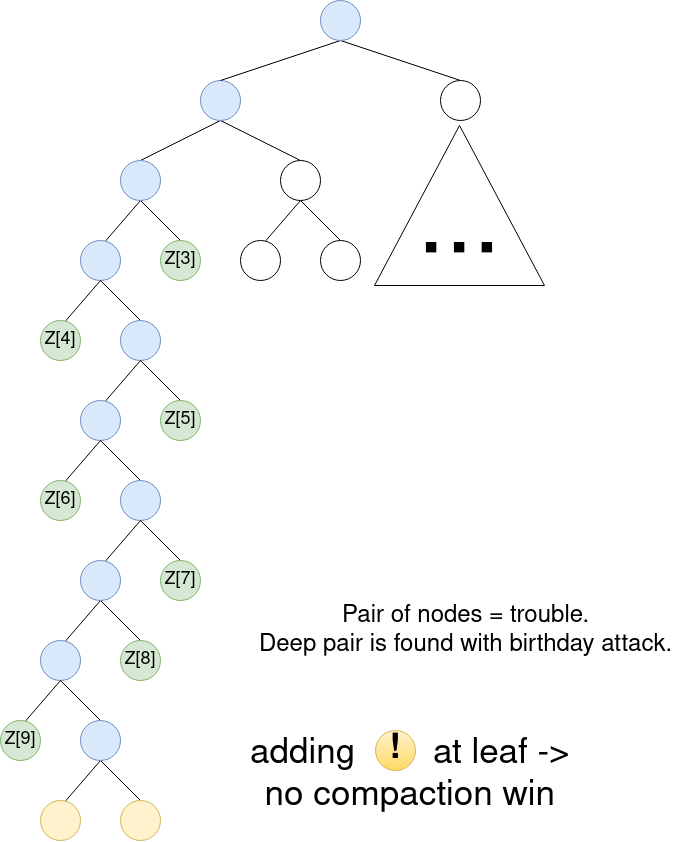
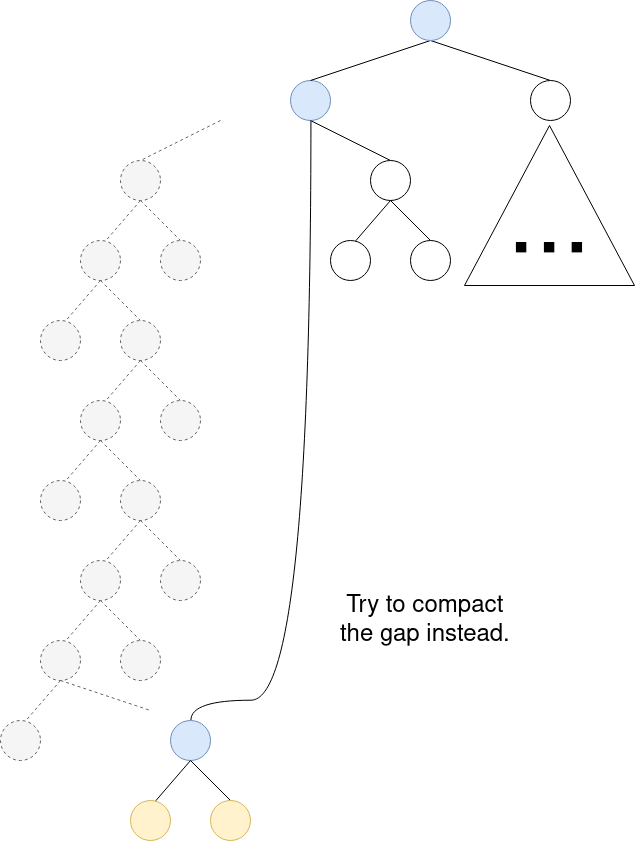
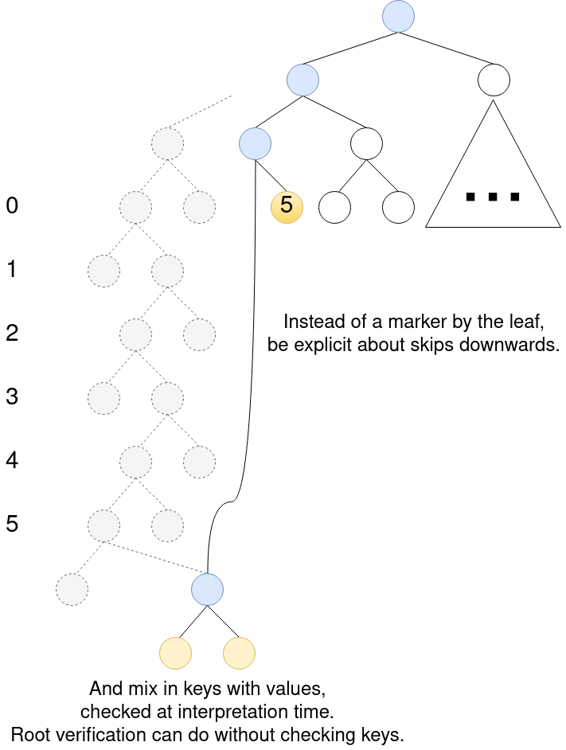
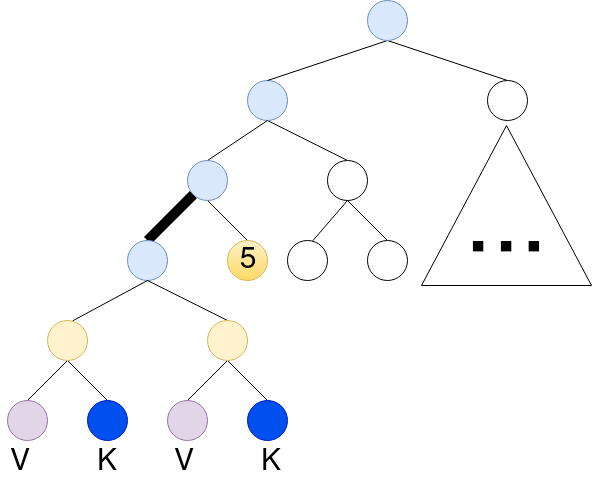
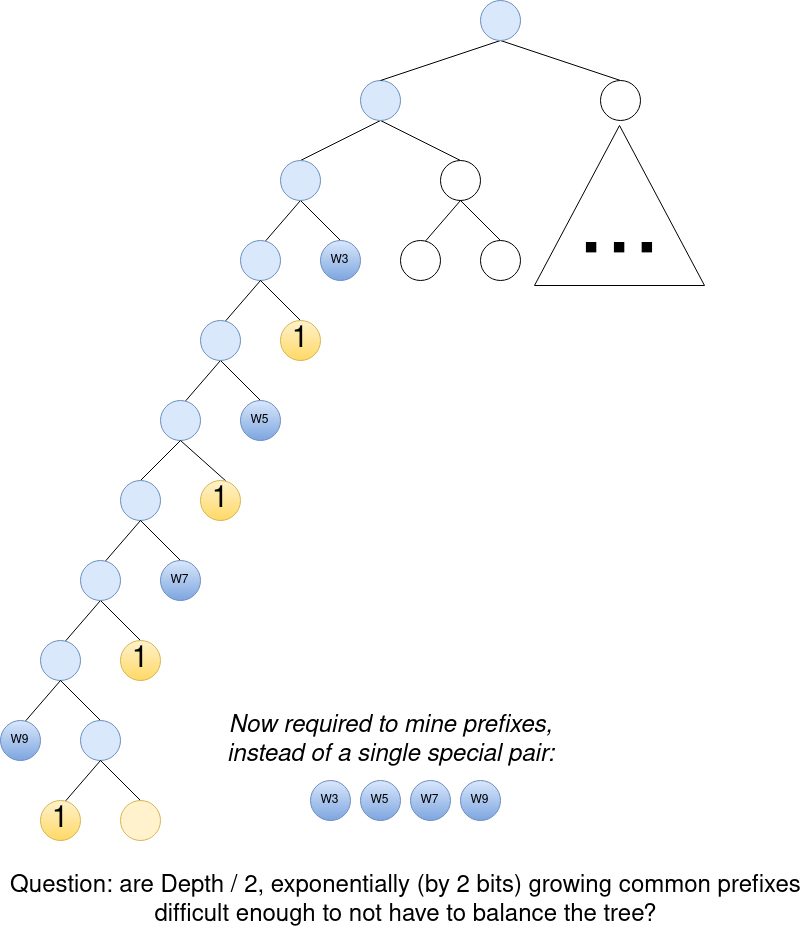

# Compact Sparse Merkle Trees

## The compaction problem

Given a sparse merkle tree with a long key length, a full key = binary path approach results in lots of branch nodes:



Now without diverging from it being a binary tree, we can compact the end, to do away with all the zero nodes:



This requires mixing in the key, as we want the leaf to not be recognized as another key as well.
And to mix in the key, we need to make sure the key does not appear as yet another branch node. This is done by mixing in zeroes, for which no preimage is known.

### Spine problem

However, we can **force** the long spine of branch nodes by mining a pair of nodes:
 


Hashing the key helps to pick these for free, but mining a prefix is still possible (Bitcoin POW is based on this).

And this is birthday attackable: if you can any two keys with common prefixes of deep depth, it results in a very long branch.

And you could possibly attack the data from someone else by mining for a prefix close to it, and forcing the other to pay for longer proofs.

## Initial SSZ take

*From previous discussion [here](https://github.com/ethereum/eth2.0-specs/issues/1472#issuecomment-552105267)*

A sparse merkle tree, **that is still a valid binary merkle tree**, with compaction at the end of the path to the node.

----

We define a `MerkleSet[T]`, `MerkleMap[K, V]` and *generalized index annotations*.

`MerkleSet[T]`: Take the hash-tree-root of each element, this will be the identity in the set.
The set is merkleized as a compact tree, with each element in the position determined by its hash-tree-root, but each element is wrapped with a right-hand zero to mark it as a leaf element. `H(obj_T, 0x000...)`

`MerkleMap[K, V]`: As a `MerkleSet[T]`, where each element is positioned by just the hash-tree-root of `K`, but is merkleized as `H(H(V, K), 0x000...)` (incl the right-hand-zeroes as leaf marker).

Now, to access a set or map value with a stable generalized index we need the generalized index to know where to stop and look for a `0x000...` right hand in the tree.

A generalized index could be like:
```
1aaaa...aaaabbbb...bbbbcccc...cccc
aaaa...aaaa: some regular generalized index path, anything, leading to the root of the set or map.
bbbb...bbbb: 32 bytes key embedded. (set value hash-tree-root, or map key hash-tree-root)
cccc...cccc: path within the value
```

And then add an annotation like "at bit index `i` a 32 byte key can be found, follow this path like normal, but stop and skip to the end of the 32 byte key once a right-hand zeroed node is encountered. Check if the key matches the HTR of the left-hand".
And to work with for the `MerkleMap` encoding, define a second type of annotation, exactly like the first, but with a different key check: "the 32 byte key must match the next right child node" (i.e. in the pair left from the zeroes).

Such annotation could be just an index, maybe 2 bytes with the first bit reserved to describe the map case (2**15 = 32768 max merkle depth). 

And one modification could be made to consider the hash with zeroes (`H(e, 0x000...)`) as the identity, instead of the element itself. Making the content keys uniform.
The pro of not doing this would be that keys can be chosen (and made uniform manually with a hash if necessary), and more readable in the generalized index.

----

## With Gap compaction

Now let's try to compact the gap:



To compact this, we can simulate "extension nodes" (as in Merkle Patricia Trees), while still being a valid merkle tree.
This is a lot like generalizing the "marker" node that was used to identify leafs in the end-compaction approach.
Instead, it could be 31 zero bytes, and the last byte to tell how much of the key was skipped (which is then checked at leaf level with the mixed-in key).



And then the pair of nodes attack would look like a much smaller tree:



And the prefix attack changes to finding prefixes to split the gap in as many smaller gaps as possible:



## Gap compaction vs. balancing

So the question for sparse merkle trees as typed interpretation of binary trees is the choice between:

1) Hashed keys, gap compaction, mixed-in keys at leafs (also useful for other things, like finding the logical key for a storage key without preimage table).
2) Balanced binary tree: more complexity in moving subtrees around to keep it balanced, but no prefix attacks.

Personally I am in favor of 1, as it leafs unrelated subtrees intact, and is very easy to build and verify.
However, it should only be used if a branch length of ~80 is not a breaking problem (say a bitcoin miner puts its hash to attack and mines prefixes leading up to your leaf node).
It sounds like a big branch, but with ~85M accounts in the ethereum accounts tree, you already have `log2(85,000,000) = 26` guaranteed branch nodes.
So a branch is only 3 times as long as the minimum, for an attack worth approx. the difficulty of 2 bitcoin blocks (`12.5 * 2 * 8000 = 200,000 USD` at the time of writing).
Of course you have more than 10 minutes to execute, but that doesn't reduce the energy cost. So it does not seem like that much of a problem.

  
